# NeuroVisor

**AI Agent Orchestration with Firecracker MicroVM Isolation**

[](https://www.rust-lang.org/)
[](LICENSE)
[](https://www.linux-kvm.org/)
[](https://ebpf.io/)

A production-grade sandboxed code execution platform that runs LLM-generated code in isolated Firecracker microVMs. Demonstrates advanced systems programming in Rust: seccomp BPF filters, Linux capabilities, cgroups v2, eBPF LSM hooks, gRPC over vsock, and enterprise observability with distributed tracing.

---

## Architecture

```mermaid
flowchart TD
    subgraph Request["🎯 User Request"]
        A["'Calculate prime numbers'"]
    end

    subgraph Agent["AgentController"]
        B1["Session Mgmt<br/>(trace_id)"]
        B2["Tool Parser<br/>(JSON/XML)"]
        B3["Iteration Control<br/>(max: 10 turns)"]
    end

    subgraph LLM["Ollama Client"]
        C1["Tool Calling (qwen3)"]
        C2["Multi-turn Context"]
        C3["Streaming Inference"]
    end

    subgraph Pool["VM Pool"]
        D1["Pre-warmed VMs (default: 3)"]
        D2["Acquire → Execute → Destroy"]
        D3["Auto-replenish on release"]
    end

    subgraph VM["Firecracker MicroVM"]
        E1["KVM Isolation"]
        E2["Alpine rootfs"]
        E3["vsock:6000 gRPC"]
        E4["guest_agent (musl)"]
        E5["Python | Bash | JavaScript | Go | Rust"]
    end

    subgraph Response["📤 Response"]
        F["stdout/stderr/exit_code → Ollama → Final Answer"]
    end

    A --> Agent
    Agent --> LLM
    Agent --> Pool
    Pool --> VM
    VM --> Response
    Response -.->|"Loop until complete"| LLM
```



---

## Features

### Core Capabilities
- **LLM-Driven Code Execution** — Ollama integration with native tool calling, multi-turn agent loops
- **Firecracker MicroVMs** — Sub-second boot times, hardware-level isolation via KVM
- **Pre-warmed VM Pool** — Configurable pool size for instant code execution
- **Multi-Language Support** — Python, Bash, JavaScript, Go, Rust execution
- **gRPC over vsock** — Low-latency host↔guest communication without networking

### Security (Defense in Depth)
- **Seccomp BPF** — Whitelist-only syscall filtering with SECCOMP_RET_KILL
- **Linux Capabilities** — Drops 35+ dangerous capabilities at startup
- **cgroups v2** — Per-VM CPU quotas and memory limits with OOM killing
- **eBPF LSM** — Optional runtime file access control and SSRF protection
- **Rate Limiting** — Token bucket algorithm prevents guest DoS attacks
- **Ephemeral VMs** — Each request gets a fresh VM, destroyed after use

### Observability
- **30+ Prometheus Metrics** — VM pool, inference, code execution, cgroups
- **OpenTelemetry Tracing** — End-to-end trace ID propagation (host → guest → LLM)
- **LGTM Stack** — Loki, Grafana, Tempo, Prometheus via Docker Compose
- **Dual Metrics Strategy** — Aggregate (long-term) + per-trace (correlation)

---

## Security Model

```mermaid
flowchart TD
    subgraph Defense["🛡️ Defense in Depth"]
        direction TB

        L1["<b>Layer 1: CAPABILITIES</b><br/>Drops: CAP_SYS_ADMIN, CAP_SYS_PTRACE, CAP_NET_RAW...<br/>Keeps: CAP_DAC_OVERRIDE (for /dev/kvm)"]

        L2["<b>Layer 2: SECCOMP BPF</b><br/>Whitelist: ~50 safe syscalls<br/>Blocks: execve, ptrace, mount, reboot<br/>Action: SECCOMP_RET_KILL"]

        L3["<b>Layer 3: CGROUPS v2</b><br/>Memory: 256MB-1GB with OOM kill<br/>CPU: Quota-based (1-4 vCPUs)<br/>Path: /sys/fs/cgroup/neurovisor/vm-{id}/"]

        L4["<b>Layer 4: RATE LIMITING</b><br/>Token bucket (capacity=100, rate=50/sec)<br/>Prevents guest DoS on host"]

        L5["<b>Layer 5: eBPF LSM</b> (Optional)<br/>file_open: Block /etc/shadow, etc.<br/>syscall tracing: Anomaly detection<br/>Requires: --features ebpf"]

        L6["<b>Layer 6: VM ISOLATION</b><br/>Firecracker: Minimal attack surface<br/>Ephemeral: Fresh VM per request<br/>No networking: vsock-only"]

        L1 --> L2 --> L3 --> L4 --> L5 --> L6
    end

    IN["Untrusted Code"] --> L1
    L6 --> OUT["Isolated Execution"]

    style L1 fill:#e1f5fe
    style L2 fill:#fff3e0
    style L3 fill:#f3e5f5
    style L4 fill:#e8f5e9
    style L5 fill:#fce4ec
    style L6 fill:#e0f2f1
```



---

## Observability

### Prometheus Metrics

| Category | Metric | Type | Labels | Description |
|----------|--------|------|--------|-------------|
| **VM Pool** | `neurovisor_pool_warm_vms` | Gauge | — | Pre-warmed VMs ready |
| | `neurovisor_pool_active_vms` | Gauge | — | VMs currently executing |
| | `neurovisor_vm_boot_seconds` | Histogram | — | VM boot latency |
| | `neurovisor_vm_acquire_seconds` | Histogram | — | Time to acquire VM from pool |
| **Inference** | `neurovisor_requests_total` | Counter | model | Total inference requests |
| | `neurovisor_inference_duration_seconds` | Histogram | — | Ollama inference time |
| | `neurovisor_tokens_generated_total` | Counter | model | Total tokens generated |
| **Agent** | `neurovisor_agent_tasks` | Counter | status | Task outcomes (success/error) |
| | `neurovisor_agent_iterations_total` | Histogram | — | LLM turns per task |
| | `neurovisor_code_execution_duration_seconds` | Histogram | language | Execution time by language |
| | `neurovisor_llm_call_duration_seconds` | Histogram | model | Per-call LLM latency |
| | `neurovisor_model_load_duration_seconds` | Histogram | model | Cold start model loading |
| **cgroups** | `neurovisor_cgroup_memory_usage_bytes` | Gauge | vm_id | Memory consumption per VM |
| | `neurovisor_cgroup_cpu_throttled_total` | Counter | vm_id | CPU throttle events |
| **gRPC** | `neurovisor_grpc_request_duration_seconds` | Histogram | method | gRPC method latency |
| | `neurovisor_requests_in_flight` | Gauge | — | Concurrent requests |

### Distributed Tracing

Every request receives a UUID v7 trace ID that propagates through:
1. **AgentController** — Task initiation
2. **OllamaClient** — LLM inference calls
3. **VMPool** — VM acquisition
4. **Guest Agent** — Code execution (via `NEUROVISOR_TRACE_ID` env)

Traces export to Tempo via OpenTelemetry OTLP.

---

## Quick Start

### Prerequisites

| Requirement | Purpose |
|-------------|---------|
| Linux with KVM | `/dev/kvm` access for Firecracker |
| Firecracker | MicroVM runtime ([install guide](https://github.com/firecracker-microvm/firecracker/releases)) |
| Ollama | LLM inference for agent mode |
| Docker + Compose | Monitoring stack (optional) |
| Rust toolchain | Building from source |
| Root/sudo | VMs, seccomp, cgroups |

### Build

```bash
# Clone the repository
git clone https://github.com/yourusername/neurovisor.git
cd neurovisor

# Build release binaries
cargo build --release

# Build guest agent (runs inside VMs)
cargo build --release --bin guest_agent --target x86_64-unknown-linux-musl

# Create rootfs (requires Docker)
./build_rootfs.sh

# Optional: Build eBPF programs
./build-ebpf.sh
cargo build --release --features ebpf
```

### Run Daemon Mode

```bash
# Start with default settings (3 warm VMs, medium size)
sudo ./target/release/neurovisor

# Custom configuration
sudo ./target/release/neurovisor \
    --warm 5 \
    --max 20 \
    --size large \
    --otlp http://localhost:4317
```

The daemon starts:
- **VM Pool** — Pre-warms VMs in background
- **gRPC Server** — Listens on port 50051
- **Metrics Server** — Prometheus endpoint on port 9090

---

## Agent Mode

Run a single LLM-driven task with automatic code execution:

```bash
# Basic usage
sudo ./target/release/neurovisor --agent "Write a Python script that calculates fibonacci"

# Specify model
sudo ./target/release/neurovisor --agent "Find prime numbers under 100" --model qwen3

# With observability
sudo ./target/release/neurovisor --agent "Create a sorting algorithm" \
    --otlp http://localhost:4317 \
    --pushgateway http://localhost:9091
```

### Agent Flow

1. **Task received** → AgentController creates session with trace_id
2. **LLM call** → Ollama generates response with tool calls
3. **Tool execution** → VM acquired, code runs in sandbox
4. **Result returned** → stdout/stderr sent back to LLM
5. **Loop** → Repeat until LLM returns final answer (max 10 iterations)

### Output

```
Task: "Calculate the first 10 fibonacci numbers"
trace_id: 01941ab3-6d8c-7a2b-b4e1-9c1234567890

[Iteration 1] Calling qwen3...
[Tool Call] execute_code(python, "def fib(n):\n    a, b = 0, 1...")
[Execution] exit_code=0, duration=45ms
[Iteration 2] Calling qwen3...

Result: The first 10 Fibonacci numbers are: 0, 1, 1, 2, 3, 5, 8, 13, 21, 34

Stats:
  - Iterations: 2
  - Tool calls: 1
  - Model load time: 1250ms
  - Total duration: 3.2s
```

---

## Examples

Portfolio-ready demonstrations of each security and observability feature:

| Example | Description | Command |
|---------|-------------|---------|
| `seccomp_proof` | Proves seccomp kills process on forbidden syscall | `cargo run --example seccomp_proof` |
| `capabilities_proof` | Proves dropped capabilities cannot be re-raised | `cargo run --example capabilities_proof` |
| `rate_limit_proof` | Proves token bucket rate limiting enforcement | `cargo run --example rate_limit_proof` |
| `cgroups_demo` | CPU/memory limit enforcement with OOM | `cargo run --example cgroups_demo` |
| `ebpf_proof` | eBPF syscall tracing via tracepoints | `cargo run --example ebpf_proof --features ebpf` |
| `lsm_proof` | eBPF LSM file access blocking | `cargo run --example lsm_proof --features ebpf` |
| `metrics_demo` | Prometheus metrics export demonstration | `cargo run --example metrics_demo` |
| `trace_id_demo` | UUID v7 distributed tracing propagation | `cargo run --example trace_id_demo` |
| `streaming_latency` | Token streaming performance measurement | `cargo run --example streaming_latency` |

---

## Configuration

### CLI Flags

| Flag | Default | Description |
|------|---------|-------------|
| `--warm` | 3 | Number of pre-warmed VMs in pool |
| `--max` | 10 | Maximum VMs (warm + active) |
| `--size` | medium | VM size tier: small/medium/large |
| `--snapshot` | — | Use snapshot for faster boot |
| `--agent "task"` | — | Run single task in agent mode |
| `--model` | qwen3 | Ollama model for agent mode |
| `--otlp` | — | OpenTelemetry OTLP endpoint |
| `--pushgateway` | — | Prometheus Pushgateway URL |

### VM Size Tiers

| Size | vCPUs | Memory | Use Case |
|------|-------|--------|----------|
| Small | 1 | 256 MB | Simple scripts, quick calculations |
| Medium | 2 | 512 MB | Standard workloads (default) |
| Large | 4 | 1024 MB | Complex tasks, compilation |

### Environment Variables

| Variable | Default | Description |
|----------|---------|-------------|
| `OLLAMA_HOST` | `http://localhost:11434` | Ollama API endpoint |
| `NEUROVISOR_POOL_SIZE` | `3` | Number of pre-warmed VMs |
| `NEUROVISOR_MAX_VMS` | `10` | Maximum concurrent VMs |

### Default Paths

| Resource | Path |
|----------|------|
| Kernel | `./vmlinuz` |
| Root filesystem | `./rootfs.ext4` |
| Snapshot (optional) | `./snapshot_file` |
| Memory file (optional) | `./mem_file` |

---

## Monitoring Stack

### Start LGTM Stack

```bash
cd monitoring
docker-compose up -d
```

### Services

| Service | Port | URL | Credentials |
|---------|------|-----|-------------|
| Grafana | 3000 | http://localhost:3000 | admin / neurovisor |
| Prometheus | 9091 | http://localhost:9091 | — |
| Tempo | 3200 | http://localhost:3200 | — |
| Loki | 3100 | http://localhost:3100 | — |
| OTEL Collector | 4316 | gRPC endpoint | — |

### Data Flow

```mermaid
flowchart LR
    NV["🖥️ NeuroVisor<br/>--otlp :4316"]

    subgraph OTEL["OpenTelemetry Collector"]
        OC["Receivers → Processors → Exporters"]
    end

    subgraph Backends["Storage Backends"]
        T["📊 Tempo<br/>Traces"]
        P["📈 Prometheus<br/>Metrics"]
        L["📝 Loki<br/>Logs"]
    end

    G["📉 Grafana<br/>Dashboards"]

    NV --> OTEL
    OTEL --> T
    OTEL --> P
    OTEL --> L
    T --> G
    P --> G
    L --> G
```



---

## Development

### Building eBPF Programs

```bash
# Install prerequisites
rustup component add rust-src --toolchain nightly
cargo install bpf-linker

# Build eBPF object files
./build-ebpf.sh

# Build with eBPF feature
cargo build --features ebpf
```

**Kernel Requirements:**
- Linux 5.8+ with `CONFIG_BPF_SYSCALL=y`
- `CONFIG_BPF_LSM=y` for LSM hooks
- CAP_BPF + CAP_PERFMON (or root)

### Building Root Filesystem

```bash
# Creates 1GB ext4 image with:
# - Alpine 3.19 base
# - Python 3 + pip
# - Rust + Cargo
# - Node.js
# - guest_agent binary
./build_rootfs.sh
```

### Running Tests

```bash
# Unit tests
cargo test

# Run with debug logging
RUST_LOG=debug cargo run

# Specific example
cargo run --example seccomp_proof

# Formatting and lints
cargo fmt --check
cargo clippy
```

### gRPC Client Example

```bash
# Using grpcurl
grpcurl -plaintext -d '{"prompt": "Hello, world!", "model": "llama3.2"}' \
    localhost:50051 inference.InferenceService/Infer

# With trace ID
grpcurl -plaintext \
    -H 'x-trace-id: my-trace-123' \
    -d '{"prompt": "Hello!", "model": "llama3.2"}' \
    localhost:50051 inference.InferenceService/Infer
```

---

## Project Structure

```
neurovisor/
├── src/
│   ├── main.rs                  # Daemon + agent CLI entry points
│   ├── lib.rs                   # Library exports
│   ├── agent/
│   │   ├── controller.rs        # LLM orchestration, tool calling
│   │   └── sessions.rs          # Session state management
│   ├── vm/
│   │   ├── manager.rs           # Firecracker process lifecycle
│   │   ├── pool.rs              # Pre-warmed VM pool management
│   │   └── handle.rs            # Individual VM handle abstraction
│   ├── grpc/
│   │   ├── server.rs            # Host gRPC service (InferenceService)
│   │   └── execution_client.rs  # Client for guest ExecutionService
│   ├── ollama/
│   │   └── client.rs            # Ollama API with tool calling
│   ├── security/
│   │   ├── seccomp.rs           # BPF syscall filters
│   │   ├── capabilities.rs      # Linux capability management
│   │   └── rate_limit.rs        # Token bucket rate limiter
│   ├── cgroups/
│   │   └── mod.rs               # cgroups v2 resource limits
│   ├── ebpf/
│   │   ├── manager.rs           # eBPF program loader
│   │   ├── security/            # LSM security hooks
│   │   └── tracing/             # Syscall tracing programs
│   ├── metrics/
│   │   └── mod.rs               # Prometheus metrics registry
│   └── tracing.rs               # OpenTelemetry setup
├── guest/agent/
│   └── main.rs                  # In-VM gRPC execution server
├── ebpf-programs/               # eBPF kernel programs (bpfel target)
├── proto/
│   ├── inference.proto          # LLM inference service
│   └── execution.proto          # Code execution service
├── examples/                    # 12 proof-of-concept demonstrations
├── monitoring/
│   ├── docker-compose.yml       # LGTM stack
│   ├── grafana/                 # Dashboard provisioning
│   ├── prometheus/              # Scrape configs
│   ├── tempo/                   # Trace storage config
│   └── otel/                    # Collector pipeline
├── build-ebpf.sh                # eBPF build script
├── build_rootfs.sh              # Alpine rootfs builder
└── Cargo.toml                   # Workspace configuration
```

---

## Technical Decisions

### Why Firecracker?

| Alternative | Drawback | Firecracker Advantage |
|-------------|----------|----------------------|
| Docker/containers | Shared kernel, weaker isolation | Hardware virtualization via KVM |
| Full VMs (QEMU) | Slow boot (seconds), heavy | <125ms boot, minimal attack surface |
| gVisor | Limited syscall compatibility | Full Linux kernel in guest |
| Kata Containers | Complex orchestration | Purpose-built for microVM workloads |

### Why vsock Instead of TCP?

- **No network stack** — Reduces attack surface significantly
- **Lower latency** — Direct host↔guest channel without routing
- **Simpler security** — No IP address management, firewall rules
- **Guest isolation** — No network access from guest

### Why eBPF for Security?

- **Kernel-level enforcement** — Cannot be bypassed from userspace
- **Low overhead** — JIT-compiled, minimal performance impact
- **Runtime flexibility** — Load/unload without kernel reboot
- **Rich context** — Access to syscall arguments, file paths, PIDs

### Why UUID v7 for Trace IDs?

- **Sortable** — Timestamp-based ordering for debugging
- **Unique** — No collision risk across distributed systems
- **Standard** — Compatible with OpenTelemetry, Jaeger, etc.

---

## License

MIT License — see [LICENSE](LICENSE) for details.

---

<p align="center">
  <sub>Built with Rust, Firecracker, and a healthy respect for syscalls.</sub>
</p>
